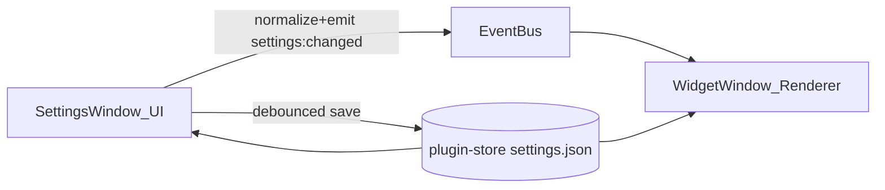

# Architecture (BreatheWidget)

This project is a **Tauri v2** app with a **two-window** UI:

- **Widget window (`main`)**: frameless, transparent, always-on-top “breather” preview.
- **Settings window (`settings`)**: normal decorated window containing all controls.

The key design goal is: **settings are authoritative**, and the widget is a **pure renderer**.

## High-level data flow

## Windows and responsibilities

### Widget window (`main`)
- **Role**: render the breathing object; provide minimal controls (gear + exit); support drag and custom resize handles.
- **Does**:
  - Loads settings once at startup from the store and renders them.
  - Listens for `settings:changed` and re-renders immediately.
  - Implements frameless resize handles (`startResizeDragging`) and keeps the breather object square.
- **Does not**:
  - Persist settings (no writes to store).
  - Own validation rules (it reuses the shared normalizer).

Relevant files:
- `src/index.html`: widget markup (gear/exit, resize handles, breather object)
- `src/styles.css`: widget styling, drag region, hover chrome, resize handles
- `src/main.js`: wiring (open settings window, exit app, resize handles, apply settings)
- `src-tauri/tauri.conf.json`: window config for `main`

### Settings window (`settings`)
- **Role**: the single runtime authority for settings.
- **Does**:
  - Loads stored settings → normalizes → updates UI.
  - On UI change: updates in-memory settings, **emits the full normalized settings object** immediately.
  - Persists to disk using **debounced `store.save()`** (reduces write frequency).
  - On window close: hides instead of destroying, and flushes pending save.

Relevant files:
- `src/settings.html`, `src/settings.css`, `src/settings.js`
- `src-tauri/tauri.conf.json`: window config for `settings`

## Shared settings model (single source of truth)

To avoid “add a setting in 4 places”, settings schema logic is centralized here:

- `src/settingsModel.js`
  - `defaultSettings()`: defaults for all settings
  - `normalizeSettings(partial)`: **coerce + clamp + fill defaults** and return a valid settings object
  - constants: `SETTINGS_EVENT`, `STORE_FILE`, `STORE_KEY`
  - optional: `SETTINGS_VERSION`, `migrateSettings()` stub for future changes

**Rule of thumb when adding a setting:**
1. Add it to `defaultSettings()` and `normalizeSettings()` in `src/settingsModel.js`.
2. Add the UI control in `src/settings.html` and wire it in `src/settings.js`.
3. Apply it in the renderer in `src/main.js` (typically inside `applySettings()`).

## Inter-window communication

- Event name: `settings:changed` (constant exported from `src/settingsModel.js`)
- Sender: settings window (`src/settings.js`)
- Receiver: widget window (`src/main.js`)
- Payload: **the entire normalized settings object** (not deltas), to avoid merge ambiguity.

## Persistence

Persistence uses the official store plugin:

- Plugin: `tauri-plugin-store`
- File: `settings.json` (store file name)
- Key: `"settings"` (store key)

**Strategy**:
- Persist “often enough” but not on every slider tick:
  - `store.set(...)` occurs when settings change.
  - `store.save()` is debounced (and flushed on settings window close).

## Frameless interactions: drag + resize

### Dragging
- Implemented with CSS app region:
  - The breather object (`.object`) is the drag region.
  - Buttons and resize handles use `-webkit-app-region: no-drag`.

This avoids the common frameless pitfall where “everything is draggable” breaks clicks/hover.

### Resizing
- The widget window is `resizable: true` in `src-tauri/tauri.conf.json`.
- The UI provides 8 resize handles (N/S/E/W + corners) that call:
  - `getCurrentWindow().startResizeDragging(direction)`
  - Directions are Tauri v2 strings: `North`, `South`, `East`, `West`, `NorthEast`, `NorthWest`, `SouthEast`, `SouthWest`.

The breather object stays **1:1** by computing a square `--object-size` based on the widget’s current bounds.

## Permissions / capabilities

Tauri v2 uses an allowlist-style capability model:

- `src-tauri/capabilities/default.json` grants only what the UI needs.

Notable permissions used by this app:
- **Window control**: show, focus, center, hide, destroy
- **Resize dragging**: `core:window:allow-start-resize-dragging`
- **Events**: `core:event:default`
- **Store**: `store:default`

If a UI feature “does nothing”, permissions are a prime suspect.

## Known trade-offs (intentional)

- **Two windows** instead of “inline settings panel”:
  - More robust layout/UX (no overflow/squish) and keeps widget minimal.
  - Slightly more coordination (events + store) but mitigated via shared settings model.
- **Image stored as Data URL**:
  - Simple and portable, but can bloat `settings.json`.
  - If this becomes a problem, switch to persisting a file path + copying into an app-managed directory.

